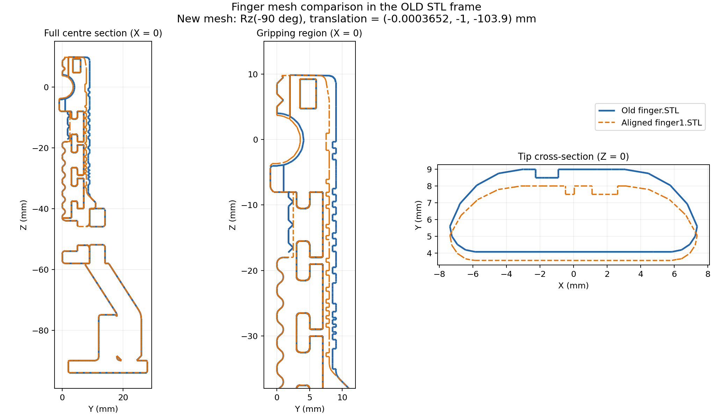

# 自定义手指 STL 替换记录

2026-09-08：当前使用 `meshes/research_finger/finger1.STL`。旧版 `finger.STL`
保留用于比较和回退。两个原始 STL 均未重新导出或修改顶点。

随后依据用户补充的两份完整 CAD URDF，以手掌为基准复核并修正了初次仅靠手指
几何配准得到的装配位置。当前 Xacro 采用下文的 **URDF 装配变换**。

## 手指几何配准

新版与旧版的导出坐标系不同，不能只替换文件名。下面是直接读取 STL 顶点所得
的包围盒，表内单位为 mm（STL 中的数值按 m 使用）：

| 轴 | 旧版 `finger.STL` | 新版 `finger1.STL`，未对齐 | 新版，对齐到旧 STL 坐标系 |
| --- | --- | --- | --- |
| X | -10.5 ～ 10.5 | -29 ～ 0 | -10.5 ～ 10.5 |
| Y | -1 ～ 28 | -10.499635 ～ 10.500365 | -1 ～ 28 |
| Z | -93.9 ～ 12 | 10 ～ 115.9 | -93.9 ～ 12 |

同一坐标系下，两版的整体尺寸均为 `21 × 29 × 105.9 mm`，无需缩放。
仅根据未修改的安装几何，将新版手指形状配准到旧版的刚体变换为：

```text
p_old = Rz(-pi/2) * p_new + t

R = [ 0  1  0 ]
    [-1  0  0 ]
    [ 0  0  1 ]

t = (-0.0000003652, -0.001, -0.1039) m

x_old =  y_new - 0.0000003652
y_old = -x_new - 0.001
z_old =  z_new - 0.1039
```

这是绕 Z 轴旋转 -90° 后再平移；不是镜像。核对结果：

- 新版共 7,494 个唯一顶点，其中 6,261 个（83.55%）变换后与旧版顶点重合，
  判定容差为 `0.0001 mm`。顶点比例不等于曲面面积比例。
- 旧 STL 坐标系中 `Z < -40 mm` 的安装侧区域，两版均有 1,298 个唯一顶点，
  全部在上述容差内匹配，最大最近顶点距离约 `0.0000033 mm`，属于文件数值误差。
- 未重合顶点集中在旧坐标系的 `Z ≈ -35.586 ～ 12 mm` 夹持段。
  例如 `Z = 0` 截面的一侧外壁由 `Y = 9 mm` 改为 `Y = 8 mm`，局部轮廓也有变化。
  这部分是实际几何修改，不能通过调整整个手指位姿消除。

下图蓝色为旧版，橙色虚线为几何配准后的新版，所有坐标均使用旧 STL 坐标系。
此图用于辨别形状变化，不包含下文由完整 URDF 确认的微小装配位移：



## 以手掌为基准的 URDF 复核

复核来源为工作区根目录下的两个 CAD 导出包：

- 旧版：`Franka_Hand_Reasearch_FR3_description/`
- 新版：`Franka_Hand_Reasearch_FR3_description-1/`

旧包的 `meshes/finger1.STL` 与本包的 `finger.STL` 字节完全一致；新包的
`meshes/finger1.STL` 与本包的同名文件字节完全一致，因此比对对象正确。

两份 `base_palm.STL` 的原始坐标系也发生了变化。以旧手掌为固定基准，新手掌到
旧手掌的变换为（平移单位 m）：

```text
T_old_palm_new_palm =
    [ 0  0  1  -0.0000003652 ]
    [-1  0  0   0            ]
    [ 0 -1  0   0.0294       ]
    [ 0  0  0   1            ]
```

两份手掌均有 15,734 个唯一顶点，经此变换全部一一匹配，最大距离约
`0.0000022 mm`。手掌在 STL 数值精度范围内重合。

将手掌变换与两份 URDF 的 joint origin 相乘，比较各关节 `q = 0` 时的装配：

- 旧版手指 joint origin：`xyz="0 0 0.1548"`，`rpy="0 0 0"`。
  旧 MoveIt 模型的安装高度 `0.0584 + 0.0964 = 0.1548 m` 与之完全一致。
- 新版 finger1 joint origin：
  `xyz="0.00102233220999699 -0.0215 0"`，`rpy="pi/2 0 0"`。
- 新版 finger2 joint origin：
  `xyz="-0.00102233220999702 -0.0215 0"`，`rpy="-pi/2 0 pi"`。

以 finger1 为例，真正的新版 STL 到旧版 STL 装配坐标系变换为：

```text
T_old_finger_new_finger = inverse(T_old_palm_old_finger)
                          * T_old_palm_new_palm
                          * T_new_palm_new_finger

R = Rz(-pi/2)
t = (-0.0000003652, -0.001022332209997, -0.1039) m
```

初次手指几何配准的旋转和 Z 偏移正确，但它消除了新版 CAD 中一个真实的微小
装配位移。当前相对初次替换的修正如下；均表达在每个夹爪的 hand 坐标系中：

| 手指 | ΔX (mm) | ΔY (mm) | ΔZ (mm) |
| --- | ---: | ---: | ---: |
| leftfinger / CAD finger1 | 0 | -0.022332209997 | 0 |
| rightfinger / CAD finger2 | -0.0007304 | +0.022332209997 | 0 |

开合方向每侧向内约 `0.022332 mm`，对应的两侧位置间距缩小约 `0.044664 mm`。
这里描述的是装配位移，不包含夹持轮廓修改对局部实际间隙的影响。
rightfinger 的微小 X 修正来自共同手掌原点偏移和该手指的反向安装，不能把
leftfinger 的 mesh origin 原样复用于 rightfinger。

新版 CAD 的两根手指 STL 局部顶点集合相同至浮点误差（最大最近顶点距离约
`2.1e-14 mm`），因此当前仍可共用 `finger1.STL`，分别设置安装 origin。
复核的是零位装配；CAD 导出的关节轴、限位与 MoveIt 的开合符号约定不同，
不用于替换现有控制约定。

## Xacro 中的替换

配置在 `config/research_franka_hand.xacro` 的四个局部属性中集中维护：

```xml
<xacro:property name="research_finger_mesh"
                value="package://dual_fr3_moveit_config/meshes/research_finger/finger1.STL"/>
<xacro:property name="research_left_finger_xyz"
                value="-0.0000003652 -0.001022332209997 -0.0075"/>
<xacro:property name="research_right_finger_xyz"
                value="0.0000003652 -0.001022332209997 -0.0075"/>
<xacro:property name="research_finger_rpy" value="0 0 ${-pi/2}"/>
```

旧 mesh 相对 finger link 的平移为 `(0, 0, 0.0964) m`，因此合成后的 Z 平移是
`0.0964 - 0.1039 = -0.0075 m`。不要把 STL 到 STL 的 `-0.1039 m` 直接填入
URDF 的 mesh origin。

四根手指的 visual 和 collision 都使用这些属性；普通版和 Gazebo 版 URDF
均引用同一个宏。对侧手指已有的 joint 绕 Z 轴旋转 `pi` 仍由关节定义处理。
关节原点、运动轴、限位、mimic 和 TCP 均沿用原定义；mesh origin 对齐新版 CAD
的零位装配。
现有 TCP 相对 hand 的 `Z = 0.1524 m` 不需要因该导出变换而改变。本次没有重新
标定实际夹持接触点，也未更新原本沿用 Franka 手指的惯性参数。

修改后需要安装新增 mesh，再重新启动正在运行的 launch/RViz：

```bash
cd /home/jerry/franka_ros2_ws
source /opt/ros/humble/setup.bash
colcon build --packages-select dual_fr3_moveit_config --symlink-install
source install/setup.bash
```

回退时一起恢复四个属性：mesh 指向 `finger.STL`，左右两个 xyz 均设为
`0 0 0.0964`，rpy 设为 `0 0 0`。不能只切回旧文件名而保留新版补偿。

## 验证范围

- `dual_fr3_moveit_config` 构建、安装。
- 普通版和 Gazebo 版 Xacro 展开及 `check_urdf` 检查。
- 每版展开后恰有 8 组 finger visual/collision 使用新版 mesh 和补偿位姿。
- 两版 URDF 除上述 mesh 文件引用和 origin 属性外，与替换前内容一致。
- 安装空间中的所有 mesh 引用均可解析，包括新增的 `finger1.STL`。
- 两版 `load_gripper:=false` 分支正常展开。
- 手掌全部 15,734 个顶点一一匹配，最大距离约 `0.0000022 mm`。
- 按手掌变换与 CAD joint origin 独立合成目标装配，与两版展开 URDF 的四根手指
  visual/collision 逐一比对；零位顶点集合一致至浮点误差。
- 本轮精确修正仅改变了左右手指的 mesh origin，其他展开 URDF 内容与初次替换一致。

未启动真机运动或 Gazebo 动力学仿真。
